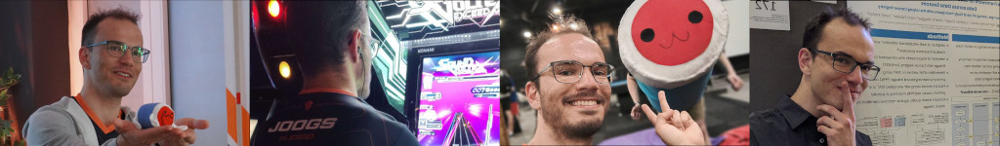

+++
date = '2024-12-19T21:02:20+01:00'
draft = false
title = 'Eulenbude'
+++

Hi!
My name is Max.
I'm a 20-something person doing his best and I own the best owl mug in the world.
Welcome to my corner of the internet where I dump all my tech-related ramblings and more.

<!--more-->

My interests are many.
For one, I love continuously learning about cybersecurity, as well as system and server administration.
I volunteer at [Leipzig eSports e.V.](https://leipzigesports.de) and help them out with keeping all their infrastructure secure, maintainable and up to date.
On my day job in medical informatics, I deploy applications that allow researchers to conduct studies on medical data while keeping patient information safe.

I also like games --- rhythm games to be precise.
I like them so much in fact that I spent a decent amount of time lending my voice to commentate rhythm game tournaments, from small community-run ones to official world cups.
Nowadays I rest my voice and instead focus on bringing the joy of rhythm games to the people by running local events where newcomers and experienced players can get into the groove together.

I also obsess over owls more often than not.

That's the gist of it all.
If you are curious about odd technical deep dives, check out [some of the stuff I wrote]().
And while you're here, could you keep the owl at the bottom of this page some company?
I heard it likes head pats.
Credit for the owl sprite goes to [Nyrax](https://www.instagram.com/nyraxart/).
