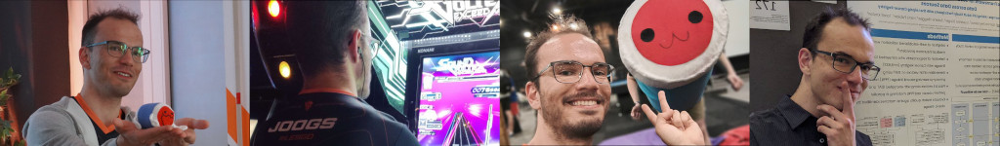

+++
date = '2024-12-19T21:02:20+01:00'
draft = false
title = 'Eulenbude'
+++

Hi!
My name is Max.
I'm a 20-something person doing his best and I own the best owl mug in the world.
Welcome to my corner of the internet where I dump all my tech-related ramblings and more.

<!--more-->

I started working in medical informatics where I developed and deployed applications that allow resarchers to conduct studies on medical data.
Keeping patient information safe was my top priority, which is why I also researched and implemented concepts on the bleeding edge of data privacy.

Since then, I switched professions to help business clients move their services into Europe's soon-to-be biggest sovereign cloud environment.
(I'm still getting started, so bear with me.)
When I'm not doing that, I volunteer at [Leipzig eSports](https://leipzigesports.de).
As their tech lead, I keep all of their services and servers up-to-date and develop their future IT strategy with the help of many other cool people.

I also like games --- rhythm games to be precise.
I like them so much in fact that I spent a decent amount of time lending my voice to commentate rhythm game tournaments, from small community-run ones to official world cups.
Nowadays I rest my voice and instead focus on bringing the joy of rhythm games to the people by running local events where newcomers and experienced players can get into the groove together.

I also obsess over owls more often than not.

That's the gist of it all.
If you are curious about odd technical deep dives, check out [some of the stuff I wrote]().
And while you're here, could you keep the owl at the bottom of this page some company?
I heard it likes head pats.
Credit for the owl sprite goes to [Nyrax](https://www.instagram.com/nyraxart/).
