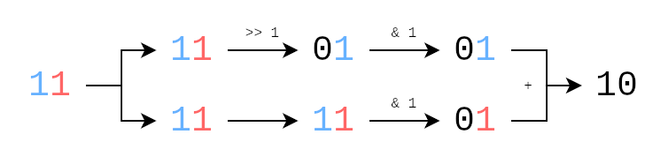
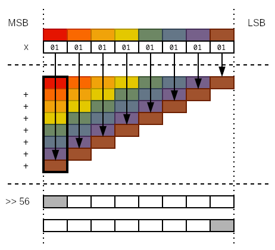

+++
date = '2023-02-08T21:46:14+01:00'
draft = false
title = 'How to count bits at the speed of light'
tags = ["compsci", "programming", "pprl", "bitwise", "binary", "memory", "computer", "popcnt", "popcount", "hamming", "weight", "data structure", "computer science", "bitset", "bits", "magic", "magic number"]
description = "I've been talking about Bloom filters a lot in my series about my master thesis. This time, I want to go one step deeper. Bloom filters operate on bitsets which, in turn, are represented as arrays of 64-bit unsigned integers in memory. An operation that has to be executed a lot in the field of record linkage with Bloom filters is to count the amount of set bits in the underlying bitset. This operation is also called computing the \"Hamming weight\", \"population count\" or \"popcount\" depending on who you ask. If you ask me, I prefer \"popcount\" because it's short and snappy, so that's what I'm going to call it from this point forward."
+++

> This post is part of a series on Bloom filter based privacy-preserving record linkage.
> If you're new to this series, then I highly recommend you read the first post as a primer on what you're getting yourself into.
>
> - [Find duplicates in your datasets with this one weird data structure]()
> - [You show me your bits, I show you who you are]()
> - **[How to count bits at the speed of light]()**
> - [Becoming one in a million by giving up your data]()

I've been talking about Bloom filters a lot in my series about my master thesis.
This time, I want to go one step deeper.
Bloom filters operate on bitsets which, in turn, are represented as arrays of 64-bit unsigned integers[^1] in memory.
An operation that has to be executed a lot in the field of record linkage with Bloom filters is to count the amount of set bits in the underlying bitset.
This operation is also called computing the "Hamming weight", "population count" or "popcount" depending on who you ask.
If you ask me, I prefer "popcount" because it's short and snappy, so that's what I'm going to call it from this point forward.

Most of the code for my master thesis is written in Java (sigh), so I eventually began to wonder just how popcount is implemented.
With how many times this operation has to be carried out, there surely must be some trick to make it run super fast, right?
So I looked into the [Long class](https://github.com/openjdk/jdk/blob/6475501a01268f5c35a9bf30f4104ce7a40d8181/src/java.base/share/classes/java/lang/Long.java#L1835) --- Java's "object class representation" of 64-bit integers --- inside the OpenJDK source code and ...

```java
public static int bitCount(long i) {
	// HD, Figure 5-2
	i = i - ((i >>> 1) & 0x5555555555555555L);
	i = (i & 0x3333333333333333L) + ((i >>> 2) & 0x3333333333333333L);
	i = (i + (i >>> 4)) & 0x0f0f0f0f0f0f0f0fL;
	i = i + (i >>> 8);
	i = i + (i >>> 16);
	i = i + (i >>> 32);
	return (int)i & 0x7f;
}
```

... what?

Magic numbers, bitwise operations and the result is computed in-place, meaning that no temporary variables are required.
I was immediately hooked and began my deep dive into this topic.
In this post, I want to showcase my journey towards understanding this weird blob of code and how one might come up with this algorithm themselves.
If you wanna try and understand this snippet for yourself, go ahead and try it now!
But if you keep reading, I'm assuming you're fine with me "spoiling" the solution.

## Bit by bit

There are some basic assumptions I'm making from this point forward.
As said in the intro, we'll focus on computing the popcount for a 64-bit integer.
Once we know that, we can simply scale up to bitsets of arbitrary size by summing up the results for every integer in the underlying array.
I'm also not going to rely on external libraries or built-in functions from any programming language.
The resulting code should be portable to any platform.

So, let's start by thinking about an easy approach to popcount.
We'll cut ourselves some slack for now.
To make things as simple as possible, let's store the result in a temporary counter variable for now.
We could iterate over all bits in our integer.
For every integer, we check whether the bit is set.
If that's the case, we increment the counter variable by one.
Once we're done, we return our counter.

A nifty way of looping over the bits of an integer goes as follows.
First, we check the value of the least significant bit (LSB).
Then we perform a bitwise right shift on our integer.
This way, all bits in our integer will eventually end up as the LSB once.
So armed with this knowledge, a simple implementation could look as follows.

```java
int popcount(long num) {
    int result = 0;

    // iterate over all 64 bits of the parameter
    for (int i = 0; i < 64; i++) {
        // check if the lsb is set
        if ((num & 0x1) == 0x1) {
            // if so, increment the counter
            result += 1;
        }

        // shift the number to the right by one bit
        num = num >> 1;
    }

    return result;
}
```

Hm, looks clunky.
There are a few flaws with this piece of code, so let's go through them one by one.
First off, regardless of which number we pass into this function, it will always perform 64 iterations.
This doesn't make sense if we, for example, pass in 1 as an argument.
1, in binary, has one set bit which also happens to be the least significant bit.
All other 63 bits are unset.
In this case, we already have the correct result after the first iteration.

We want to stop the loop as soon as possible, meaning once there are no more set bits that contribute towards the counter.
Fortunately, because we shift our integer to the right after every iteration, the integer will eventually end up being zero once there are no more set bits left.
So we can adjust the loop by replacing the hard-coded constant 64 with a check whether the integer is zero or not.

Another thing we can improve is the if-check inside the loop.
By performing a bitwise AND of our integer with 1, there are only two possible results: 1 if the LSB is set, and 0 if the LSB is unset.
This means that we can use the result of the bitwise AND to increment our counter, saving us the "if" statement inside our loop.
With these two improvements, the resulting code looks a lot neater.

```java
int popcount(long num) {
    int result = 0;

    // loop until there are no more set bits left
    while (num != 0) {
        // use the result of the bitwise AND to increment the counter
        result += num & 0x1;
        // this is the same as num = num >> 1, just a bit cleaner
        num >>= 1;
    }

    return result;
}
```

Not bad.
The best case of this function occurs when we pass in an integer where all bits are unset, giving us an instant result or, in big notation, _O(1)_ time.
If we pass in an integer where all bits are set however, we encounter the worst case.
The loop will have to iterate over all bits.
Assuming our integer has _n_ bits, then we get a result in linear time, or _O(n)_.
If we assume that all bits have an equal chance of being set, then we can expect that the function will return a result in _O(n/2)_ time on average.

Interestingly, this method is called "sideways addition" and is a decent and easy-to-understand approach to popcounts.
However, despite our optimization efforts, this function is still a far cry performance-wise from the function we're trying to understand.
Note how the original function doesn't require any loops and temporary variables.
This might not sound like much, but when popcounts are computed millions of times, then the latencies introduced by factors as small as these start to add up.
We obviously need a different approach.

## Everything in place

New section, new rules.
No temporary variables from this point forward.
All operations must be in-place.
Coming up with an algorithm for popcount on an arbitary integer is hard, so it's a good idea to split this problem up into smaller ~~byte~~bit-sized problems.

First, let's think about how we could add up two bits in-place.
In school, you'd simply write some terms in a column and add them up.
All we'd have to do to make this work with our two-bit input is to move the high bit in the place of the low bit and then perform a normal addition.
Fortunately, all we have to do is to shift our input to the right by one bit.
If we obtain a copy of our original input, perform a shift on it and mask the low bit in both, we have successfully aligned the high and low bit to make in-place addition work.



Let's apply this to our 64-bit input this time.
We can add every two bits onto each other, meaning that when we pull this off, we're left with 32 intermediate sums.
We'll use a bit mask that retains the low bit in every two-bit slice of our input, so in binary that's `01010101...`, or `5555...` in hexadecimal.
Seems familiar?
That's one of the magic numbers from the start of this post.
Don't forget to shift a copy of our input to the right by one bit before masking and adding, and the first line of our actual popcount looks a lot more like the snippet we started with.

```java
int popcount(long num) {
    // 0x5555... = 0b01010101...
    num = (num & 0x5555555555555555L) + ((num >> 1) & 0x5555555555555555L);
    // ...?
}
```

We can repeat this procedure, turning 32 sums into 16, 16 into 8, 8 into 4, 4 into 2 and 2 into 1.
This time, we operate on four-bit slices.
The top and bottom two bits in each slice contain terms that we want to add onto each other.
So let's create the mask for it.
We retain the lowest two bits in every four-bit slice, so `00110011...` in binary, or `3333...` in hexadecimal.
Yet another magic number!
We need to be careful to shift the copy of our input by two bits to the right this time.

```java
int popcount(long num) {
    num = (num & 0x5555555555555555L) + ((num >> 1) & 0x5555555555555555L);
    // 0x3333... = 0b00110011...
    num = (num & 0x3333333333333333L) + ((num >> 2) & 0x3333333333333333L);
    // ...?
}
```

Rinse and repeat.
With 16 intermediate sums, every sum now takes up four bits, so we perform the in-place addition in eight-bit slices this time.
Adjusting the bit mask yields `00001111...` in binary, or `0f0f...` in hexadecimal.
How convenient!
Of course, don't forget to move the input by four bits to the right this time.

```java
int popcount(long num) {
    num = (num & 0x5555555555555555L) + ((num >> 1) & 0x5555555555555555L);
    num = (num & 0x3333333333333333L) + ((num >> 2) & 0x3333333333333333L);
    // 0x0f0f0f0f... = 0b00001111...
    num = (num & 0x0f0f0f0f0f0f0f0fL) + ((num >> 4) & 0x0f0f0f0f0f0f0f0fL);
    // ...?
}
```

Sweet, the rest should be a breeze, right?
Eight sums remain, each taking up eight bits.
We can just make up the bit masks as we go and adjust the bit shift every time and we're golden, right? Technically, yes.
But there is one cool optimization to be made at this point.
We don't need to mask our bits anymore.
Why so?

Our intermediate sums take up eight bits.
This means that the range of possible sums as numeric values within these eight bits can only range from 0 to 7.
However, the amount of possible values that could be represented by eight bits ranges from 0 to 255.
Since our final sum can be 64 at max, every sum from this point forth will be very well contained within eight bits.
Masking is therefore not necessary anymore.
All we have to do is to shift and add, shift and add ...

... so, let's finish this.

```java
int popcount(long num) {
    num = (num & 0x5555555555555555L) + ((num >> 1) & 0x5555555555555555L);
    num = (num & 0x3333333333333333L) + ((num >> 2) & 0x3333333333333333L);
    num = (num & 0x0f0f0f0f0f0f0f0fL) + ((num >> 4) & 0x0f0f0f0f0f0f0f0fL);
    // eight sums with eight bits each -> four sums with 16 bits each
    num = num + (num >> 8);
    // four sums with 16 bits each -> two sums with 32 bits each
    num = num + (num >> 16);
    // two sums with 32 bits each -> one sum
    num = num + (num >> 32);
    // cast back to int
    return (int)num & 0x7f;
}
```

Now this is pretty close to the original, and for most applications this will be plenty fast.
But we're not at the end yet, because if we look elsewhere, we'll find a few more interesting optimizations.

## Adding by subtracting

You might remember from the original snippet that the first line didn't include an addition of bits but rather a subtraction.
We're saving one bitwise AND, but how does this make sense with the approach we discussed so far?

```java
public static int bitCount(long i) {
	i = i - ((i >>> 1) & 0x5555555555555555L);
    // ...
}
```

To be honest, I can offer no insights in how one might've been able to come up with this.
That won't stop me from trying though.
Let's think back to the original problem of calculating the popcount of a two-bit slice.
What we effectively want is some function that maps the inputs to the outputs shown below.

| **Input (numeric)** | **Input (binary)** | **=>** | **Output (binary)** | **Output (numeric)** |
| ------------------: | -----------------: | :----: | ------------------: | -------------------: |
|                   0 |                 00 |        |                  00 |                    0 |
|                   1 |                 01 |        |                  01 |                    1 |
|                   2 |                 10 |        |                  01 |                    1 |
|                   3 |                 11 |        |                  10 |                    2 |

Our inputs range from 0 to 3 but our outputs only go from 0 to 2.
Furthermore, 0 and 1 stay the same, while 2 and 3 are reduced by one to get the output we want.
We can see that for 2 and 3, the top bit is set.
How convenient!

All we have to do to map 2 and 3 to their correct outputs is to subtract by one and we're done.
Whether the top bit is set or not determines whether a subtraction is necessary or not.
So all we have to do is to take a copy of our input, shift the top bit in the place of the bottom bit with a bitwise right shift, mask the bit and subtract it from the input.
For 2 and 3, this will perform a subtraction by one.
But since the top bit isn't set for 0 and 1, the inputs remain untouched.

## Adding by ... multiplying?

But wait, there's more!
During my research I found another popcount variant in the [bitset Go package](https://github.com/bits-and-blooms/bitset/blob/a97a5708daa14316d97081b32530defba4e9e6ed/popcnt.go#L6).
Most of the magic we know is still there, but there is one unusual operation in there.

```go
func popcount(x uint64) (n uint64) {
	x -= (x >> 1) & 0x5555555555555555
	x = (x>>2)&0x3333333333333333 + x&0x3333333333333333
	x += x >> 4
	x &= 0x0f0f0f0f0f0f0f0f
	x *= 0x0101010101010101
	return x >> 56
}
```

The first three steps are the same.
64 bits are reduced into 32 partial popcounts, then 16, then 8.
And then there's a multiplication.
It's fairly obvious that the factor we're multiplying by has the lowest bit in every eight-bit slice set.
So what does this accomplish exactly?

For the sake of this explanation, let's pretend our input is the first and `0x0101...` the second factor.
If you recall long multiplication from school, you work from least to most significant digit of your second factor, multiply them with the first factor and take down the partial results in the columns of their respective digits.
Once you're done with all digits, you sum up all your partial results to give you the final result.

However, with the way that the second factor is structured, it just so happens that every eight-bit slice ends up in the column belonging to the first slice.
So when all results are summed up, the first column will actually contain the sum of all eight-bit slices, which just so happens to be the sum of all partial popcounts.
Shifting the final result to the right by 56 bits moves the popcount into a place where it can be easily retrieved.

This operation is better explained with a small visualization.
In the following image, all eight-bit slices are represented by a different color.
You'll see that all partial popcounts are summed up in the process of long multiplication within the first column.



## What's next?

So this was a bit (ha!) of a detour from my PPRL endeavors.
Binary operations fascinate me because of their ruthless efficiency and the way they make code look like magic.
Peeling back the layers on them to understand what they really do offers some deep insights into how computers really "work".

As for what's next in this series, I'm not sure yet.
I've covered most of the bases that I wanted to talk about.
There's one more post somewhere in my scattered master thesis notes, but it'll take some time to make sense of them.
Still, I hope you enjoyed the journey so far and learned about a few odd bits about a very unique area of research.

[^1]: The actual size of these integers depends on many factors, such as the programming language, system platform, processor architecture and available instructions. For the sake of simplicity however, I'm assuming we're talking about 64-bit unsigned integers.
