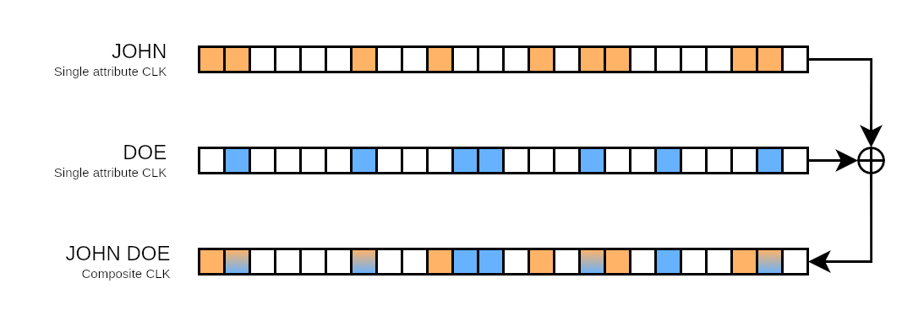
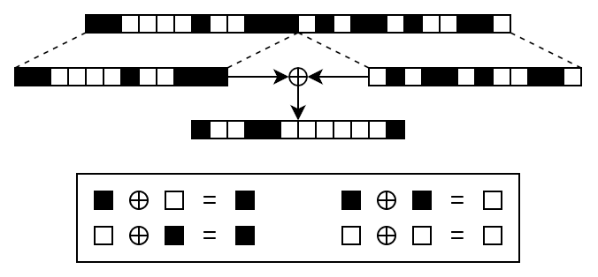
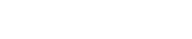
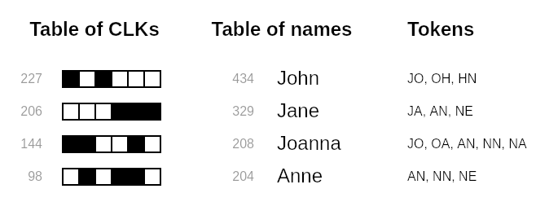
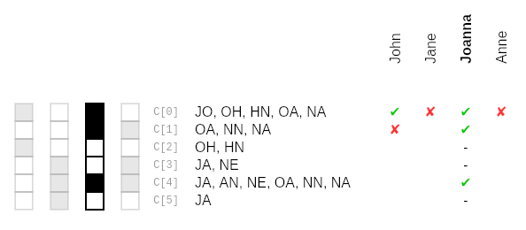
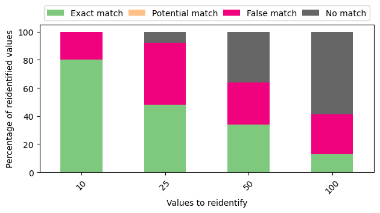
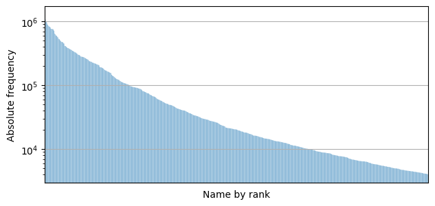

+++
date = '2022-12-11T20:36:02+01:00'
draft = false
title = 'You show me your bits, I show you who you are'
tags = ["cybersec", "privacy", "pprl", "security", "infosec", "programming", "linkage", "record", "data", "science"]
description = "In my previous post in this series, I gave an overview of how Bloom filters are applied in privacy-preserving record linkage, or PPRL for short. Bloom filters obscure the data that is inserted into them while preserving the similarity between nearly identical data records. They do this by running input data through one or multiple hash functions. The hash digests are then used to determine the indices of bits to set in the Bloom filter. If all of this flew over your head, then I highly recommend you give the previous post a read first. Understanding the basics is key to digging deeper into the potential weaknesses that Bloom filters present in record linkage scenarios. "
+++

> This post is part of a series on Bloom filter based privacy-preserving record linkage.
> If you're new to this series, then I highly recommend you read the first post as a primer on what you're getting yourself into.
>
> - [Find duplicates in your datasets with this one weird data structure]()
> - **[You show me your bits, I show you who you are]()**
> - [How to count bits at the speed of light]()
> - [Becoming one in a million by giving up your data]()

[In my previous post in this series](), I gave an overview of how Bloom filters are applied in **privacy-preserving record linkage**, or PPRL for short.
Bloom filters obscure the data that is inserted into them while preserving the similarity between nearly identical data records.
They do this by running input data through one or multiple hash functions.
The hash digests are then used to determine the indices of bits to set in the Bloom filter.
If all of this flew over your head, then I highly recommend you give the previous post a read first.
Understanding the basics is key to digging deeper into the potential weaknesses that Bloom filters present in record linkage scenarios.

Let's assume the role of a malicious actor.
To link records together, we need so-called **stable identifiers**.
These are attributes of a data record that are highly unlikely to change over a long period of time.
So when we're trying to link personal records, we will usually use highly sensitive personally identifiable information.
As attackers, we're obviously very interested in this type of data and we're going to try our hardest to get our hands on it.

With Bloom filters, the outlook seems grim.
All we're given for each data record that we're trying to re-identify is the sequence of bits produced by the Bloom filter itself.
This sequence is also known as a **cryptographic long-term key**, or CLK for short.
So to reconstruct the original data from a CLK, we have to somehow find a way to correlate bits in a CLK back to plaintext.
This process is also referred to as **data re-identification or de-anonymization**.

We know that any set bit in the CLK could've been caused by any number of inputs.
Furthermore, Bloom filters in record linkage applications will usually make use of some cryptographic hash function like _SHA-256_.
So as long as one doesn't use hash functions that are dead for good, reconstructing the original data record from a CLK seems infeasible.

You might have been quick to guess from my overuse of the word "seems" that it's indeed very much possible to reconstruct data from CLKs.
In this post, I will illustrate some basic attacks, show how to mitigate them, and go deep into one slightly more sophisticated but powerful attack.

## Bits imitate life

Most of the attacks that I'm about to present have been collected by Vatsalan et al.[^3] in an effort to provide an overview of present-day PPRL techniques.
I highly recommend having a look at the referenced work as a starting point if you wish to learn more about PPRL beyond what I'm telling you about in this series.
It's also good practice in clicking through _its_ references if you ever get stuck.

Let's assume that we have access to a large collection of CLKs generated from an equally large dataset filled with juicy personal data.
All we know is that these CLKs were generated using Bloom filters.
As mentioned before, Bloom filters in record linkage make use of cryptographic hash functions.
In this context, the challenge of re-identifying data from bit patterns of a CLK is similar to that of guessing a password given a hash digest.

As is common practice (or as it should be!), when you sign up for a service on the internet, the password you enter is never stored in plaintext.
Instead, it is run through a cryptographic hash function and the hash digest is what's stored in the service database[^1].
When a database leak occurs, no cleartext passwords are leaked.
Attackers are stuck with the task of guessing passwords and running them through the same hash function by brute force.

The main difference between CLKs and password hashes is that passwords are significantly more complex than personal data.
Public data sources of common first and last names, street and city names, phone numbers and e-mail addresses are readily available and can be found very easily in many languages.
Knowing this, a simple "brute force"-type attack on CLKs can be executed like this:

1. Collect personal data from public sources.
2. For every personal attribute, generate CLKs for all of its values Bloom filters.
3. Check for overlaps between the generated CLKs and the CLKs to re-identify.

This is an example of a **dictionary attack** on Bloom filters.
The list of CLKs you're trying to identify will usually be generated from more than one attribute.
They are also called **composite CLKs**, and you can think of them as multiple single-attribute CLKs combined into one with a binary OR.
This serves to explain why generating the CLKs for single attributes first is important for this attack to work.

Say you have a list of known first and last names.
You generate the CLKs for each first and last name.
Then you check them against the list of CLKs that you wish to re-identify.
You find that one of them overlaps with the CLKs for the first name "John" and last name "Doe".
Consequentially, you just found the first and last name that likely generated the bit pattern for the person named "John Doe".

The solution to mitigating a dictionary attack is dead simple.
Instead of equipping a Bloom filter with a plain cryptographic hash function, one should used a **keyed-hash message authentication code** (HMAC) instead.
As long as the key is not known to the attacker, it is not possible to re-identify the personal data that was used to generate a CLK without an exhaustive key search.
However, there is another simple attack that works even with the use of HMACs.

The distribution of names is not random.
Some names are bound to be more common than others because of their sustained popularity over years and decades.
In Germany, the most common surname you'll find at the time of writing this post is "Müller", which is more than twice as common as the third-ranking surname "Schneider"[^2].
So if you were to look at a large group of people, some names (and personal attributes in general) are simply going to be more common than others.

This carries over into the world of record linkage.
Keep in mind that Bloom filters obscure the data that is inserted into them while preserving their similarity.
However, this also means that the CLKs they generate preserve some statistical properties of the dataset they're generated from.
Assuming that you're given a list of CLKs that is sufficiently large, then there's bound to be bit patterns that are more common than others.
We can perform a **frequency attack** like so:

1. Collect frequency tables of personal data from public sources.
2. Sort the tables by frequency in descending order.
3. Group and count equal (or similar) bit patterns in the CLKs to re-identify.
4. Sort the list of CLKs by frequency in descending order and align with the frequency table of known values.

The attack isn't perfect and, evidently, doesn't work when the list of CLKs you're attacking is small.
But it's still good to be able to make an educated guess about the pieces of data that were used to generate a CLK.
A frequency attack of this kind would just be one step of many to fuse several information sources together to, eventually, be able to perform a successful re-identification attack.

A possible mitigation is to salt data before inserting it into a Bloom filter.
In password hashing, random characters (making up the "salt") are appended to a user's password before hashing to make sure that the resulting hash digests cannot be reversed using a lookup table.
However, this doesn't work the same way in the world of record linkage with Bloom filters.
Let's pretend we add the same salt to text tokens before we insert them into a Bloom filter.
All that's going to do is to scramble the resulting bit patterns.
There will still be more and less frequent bit patterns that align with real-world frequency distributions.

The solution is to choose a record-specific salt.
This means that in addition to the personal attributes you want to use for matching, e.g. first and last name, gender and birth date, you will need an **extra stable identifier that is sufficiently different from person to person**, and that is likely to be present in the datasets you're trying to link together.
Not only that, but this identifier must be free of errors across data sources.
Choosing a salt like this and appending it to every text token generated from a data record before insertion will, indeed, yield vastly different bit patterns.
However, finding such a salt is not trivial in most cases, since you'll want to use most available stable identifiers for matching, not for salting.

Another more recently suggested mitigation that doesn't require any additional data is a technique called **XOR folding**, as proposed by Schnell et al.[^5]
This is achieved by splitting a CLK in two halves, then combining these halves using a binary XOR operation.

The reason why this makes attacks harder is that inferring frequency information is significantly harder for the folded CLK.
For every set or unset bit in the folded CLK, there are two possible bit combinations that could've generated it.
So for a folded CLK of length _m_, there are _2m_ possible halves of a CLK that have to be considered in the frequency analysis.
This technique does impact record linkage quality negatively, but not drastically according to the current state of research.

## The key to Bloom filters

There's a detail about the dictionary and frequency attack that I left out so far, and without it, you might be wondering how on earth these attacks can even be successful.
To recap, in order to generate a CLK using Bloom filters, there are three parameters that need to be known: the Bloom filter size _m_, the size of the text tokens that are inserted into the Bloom filter _q_ and the amount of hash values to generate per token _k_.
How do you go about performing a dictionary attack without the knowledge of these parameters?

The answer is: you don't need to know.

The Bloom filter size _m_ directly correlates with the size of the CLK, so very little guesswork is required, if any.
Guessing the token size _q_ is just as trivial, for a simple reason: **the higher the token size, the less error-resistant the linkage**.

Let's take my first name for example: Maximilian.
With a token size of two, my name splits into nine unique tokens.
By including padding characters for the first and last letter, this sums up to 11 tokens in total.
Now let's pretend someone slipped on the keyboard while typing my name, turning Maximilian into Macimilian.
If we were to tokenize both names, we'd find that all except two tokens would match, namely the ones caused by the typo of replacing "x" with "c".
Or, statistically speaking, with 9 out of 11 matched tokens, there'd be a 81.8 % overlap.

| **q** |                                       **Tokens for Maximilian** | **Tokens for Macimilian**                                       |
| ----: | --------------------------------------------------------------: | :-------------------------------------------------------------- |
|     2 |                                ..., MA, **AX**, **XI**, IM, ... | ..., MA, **AC**, **CI**, IM, ...                                |
|     3 |                  ..., \_MA, **MAX**, **AXI**, **XIM**, IMI, ... | ..., \_MA, **MAC**, **ACI**, **CIM**, IMI, ...                  |
|     4 | ..., \_\_MA, **\_MAX**, **MAXI**, **AXIM**, **XIMI**, IMIL, ... | ..., \_\_MA, **\_MAC**, **MACI**, **ACIM**, **CIMI**, IMIL, ... |

If we were to increase the token size to three, including padding, my first name would split into 12 tokens.
Assuming one typo as before, there'd be three mismatched tokens this time, yielding an overlap of merely 75 %.
This percentage keeps dropping with higher token sizes.

Remember that one of the reasons Bloom filters are so popular in record linkage is that they provide error tolerance for free.
This assumes that the token size is set to a reasonable value though.
In most papers I've come across, the token size is usually set to two or three because the drop in linkage quality with higher token sizes is simply too drastic to be practical.
Fortunately, for us as attackers, this means that the possible values for _q_ are manageable.

At this stage, we can make reasonable assumptions about _m_ and _q_, which only leaves the amount of hash values per token _k_ on the table.
It's possible to simply try different values for _k_, since _k_ is the only unknown parameter at this stage.
But with a bit of math, one can trim down the options for _k_ even further.
Feel free to skip over the following section if you just want to take my word for it.
It's not required to understand the final attack that I'm about to present.
But it never hurts to dig a bit deeper.
(And I'm yet to see it written down anywhere so I'm glad to be the first if that's the case.)

> Let's assume a Bloom filter consisting of _m_ bits.
> We can assert that the hash function may select any of the _m_ bits with equal probability.
> This means that if we insert an element into the Bloom filter, every bit has a _1/m_ probability of being set, or _m-1_.
> The opposite event, namely that a bit remains unset, has a probability of _1 - m-1_ by consequence.
>
> Now let's assume that we have _n_ elements that we want to insert into the Bloom filter.
> For every element, the hash function will generate _k_ hash values.
> This means that a total of _kn_ bits will be selected.
> So the probability that a bit remains unset even after all these insertions is _(1 - m-1)kn_.
> Let's call this probability _p_.
>
> Assuming we have a list of CLKs, we can count the amount of unset bits in each one of them.
> Knowing _m_, we can compute _p_ for every CLK.
> Furthermore, we can rearrange the formula to compute _p_ to solve for _kn_ instead.
> This yields _kn = (log p) / (log (1 - m-1))_.
>
> 
>
> At the end we obtain _kn_ for every CLK.
> This seems useless because we don't know _n_.
> However it's _k_ that we're interested in, and we know _k_ is an integer.
> **By consequence, _kn_ must be the multiple of an integer.**
> In reality, _kn_ will always be some floating-point number.
> However, consider you run this calculation for a list of CLKs and you get results for _kn_ like _9.144_, _12.266_, _15.427_, _18.627_ and _21.869_.
> Stripping the decimal parts, all these numbers are multiples of three, meaning that it's highly likely that _k=3_ in this example.
> This is a very simple calculation which will leave you with very few options for _k_.

Why am I talking about this?
The answer lies in **Kerckhoffs's principle**.
It's the principle that a cryptosystem must be secure even if all details about it, except the key, are leaked.
We're dealing with sensitive data, so keeping it secure should be our primary objective.
So what is the (literal and figurative) key that's supposed to make Bloom filters in record linkage secure?

After this section, it should be clear that the basic masking parameters _m_, _q_ and _k_ are not the key.
Tweaking them does not mitigate the risk of re-identification attacks without greatly impacting the quality of record linkage results.
However, we now know two components that we can make use of that directly impact the efficiency of the aforementioned attacks.

- When using an HMAC as the hash function inside a Bloom filter, its **secret key**.
- When using an additional stable identifier to salt tokens before they're inserted into a Bloom filter, the identifier as a **salting key**.

But if you're still not convinced that basic Bloom filters aren't safe for record linkage, there is one more attack that I'd like to dig into.
It's special because not only is it fast to perform, it also doesn't require any knowledge of Bloom filter parameters.

## Being called "Peter Müller" is a security risk in Germany

Christen et al.[^4] were the first ones to describe this attack.
Once again, we're exploiting the fact that certain bit patterns are bound to appear more often than others with large datasets.
We mount a frequency attack.
This means we have a list of CLKs generated from a large dataset and a frequency table of personal data.
We group similar CLKs together, count them, and align both lists in descending order.
Furthermore, we will also split the values in our dataset into tokens.

Keep in mind that in order for a bit to be set in a CLK, at least one text token has to have been hashed into that position.
Our goal with this attack is to have a set of candidate tokens for every bit position.
We will use these sets to limit the amount of possible values that could have caused the bit pattern in a CLK.

This attack is best explained by running an example.
For the sake of this demonstration, let's assume that we know our CLKs have one single value hashed into them.
Suppose we have a list of names where "John" ranks first and "Joe" ranks second.
We also have a list of CLKs ordered by frequency.
In this attack, we look at all bit indices from _0_ to _m-1_ for each CLK.

Suppose the first bit of the most frequent CLK is set.
Since it ranks the same as "John", we add the tokens of "John" to the set _C[0]pos_.
Don't worry about the name of the set for now.
It'll make sense later.
Next, suppose the first bit of the second most frequent CLK is unset.
Since it ranks the same as "Joe", we add the tokens of "Joe" to the set _C[0]neg_.

We repeat this process for the first bit of all CLKs.
At the end of this process, _C[0]pos_ and _C[O]neg_ contain tokens that, respectively, may or may not have been hashed into this position.
Finally, we construct the set of candidate tokens for the first bit _C[0]_ by removing the elements in _C[0]neg_ from _C[0]pos_.

This is repeated for all bits.
At the end, there'll be a set of candidate tokens for every bit.
Once that's done, we go through our CLKs one by one.
For every set bit of a CLK, we consider its set of candidate tokens.
At the beginning, we assume that all possible values from our frequency table could represent the CLK.
For every value, we check if it has any overlapping tokens with the candidate token set.
If that's not the case, we no longer consider the value to be a candidate for the CLK.

By the end, we should be left with just a couple candidate values for each CLK.
If we're lucky, we're left with a single one.
If not, there's still the chance of having a few candidates to choose from.
Cross-referencing them with candidate values for other CLKs can improve results further.

This attack serves to show that by making educated guesses about the frequency distribution of CLKs, we can trim down the possible values that could make up a CLK significantly.
And, again, bear in mind that we didn't need to know any Bloom filter properties.
Well, except for the token size, of course, which can be guessed pretty easily.

The authors of the paper where the attack was first described used the **North Carolina Voter Registry dataset**, which is an open and popular dataset containing about 5 million real-world voter records spanning many years.
It is commonly used for the evaluation of record linkage algorithms.
According to their findings, the attack becomes noticeably less efficient the more attributes are being hashed into a Bloom filter and the more values we're trying to reidentify.
However, there was no mention of how many CLKs were necessary to execute a successful attack.
The authors state that about "10--100" CLKs were required, but didn't elaborate any further.

So I re-implemented the attack and put it to the test.
[You can find the code on GitHub here](https://github.com/JoogsWasTaken/bf-pprl-attack).
I grabbed a table of the 1,000 most popular German first names and their absolute frequencies.
Then I picked the top 10, 25, 50 and 100 names and generated CLKs for them.
The frequencies for these CLKs were randomly drawn based on the frequencies of the names they were generated from, meaning that the distribution of CLKs is as close to the real-world name distribution as possible.
In three different runs, I generated 100k, 10k and 1k total CLKs to see how the amount of CLKs affect the performance of the attack.
The described test setup is designed to have the best possible prerequisites for an attacker to, theoretically, achieve great results.

The first run with 100s CLKs seems promising since it aligns with the results presented by the authors.
To explain the graph: every CLK is assigned a set of candidate values by the end of the attack.
There are four different conditions that may show up.

- **Exact match**: one candidate value, that being the correct value
- **Potential match**: several candidate values, one of them being the correct value
- **False match**: several candidate values, none of them being the correct value
- **No match:** no candidate values

As stated by the authors, the attack derails the more values there are to consider.
Looking at the names I chose for my implementation of the attack, the reason becomes quite obvious.

There are a handful of names that are orders of magnitude more common than others.
Then there are a large sum of names that are popular, but they blend in with all other popular names.
And then there are the rest.
They're by no means uncommon, but due to the sheer amount of names to consider, there isn't much of a difference between, say, the 682nd and 683rd ranked name.
And since the attack is based on a regular frequency attack, the assumption that the distribution of CLKs and personal attributes greatly influences the success of the attack, even if it becomes more unreliable the more attribute values we consider.
This doesn't hold for names only, but for many types of data in social sciences according to **Zipf's law**.

So much for the effect of the amount of attribute values we consider in our attack.
This is nothing new since the authors have already found this out themselves, but I find it interesting to look at data myself to compare these kinds of findings.
However, I sought out to look at something else.
So, how does this attack scale when we have fewer CLKs available to us by an order of magnitude?

Yeah, this doesn't look good.
Even when only looking at the top 10 names, the attack could only correctly re-identify four of them.
And again, the more values we consider, the worse it gets.

This, too, doesn't improve when looking at only 1k CLKs.
With the top 50 names, the attack didn't manage to re-identify a single one of them.
However, this gives us a pretty good idea of the additional prerequisites for this attack to work that weren't covered in their entirety in the original paper.

First, as shown above, there must be a large amount of CLKs available for the frequency distribution of CLKs to take on the shape of the natural frequencies of first names, last names ... you name it.
By "large", I mean somewhere in the neighborhood of at least 100k, looking at the data I used.
Also note that errors in the data that generated these CLKs must be at a minimum, since they'd mess with the distribution of CLKs otherwise.

Second, we have to assume that the frequency tables of CLKs and possible values are of similar length.
Having a corpus of only five unique CLKs but more than 1000 candidate attribute values is going to decrease the quality of results by introducing a lot of false positive guesses.

Third, the effectiveness of this attack is greatly reduced with composite Bloom filters, as described in the introduction of this post.
The more attributes that are hashed into a Bloom filter, the higher the distribution of bit patterns across CLKs.
Frequency information is a lot harder to extract from a bunch of CLKs that way.
Also, a set bit in a CLK won't tell you which attribute is responsible for setting it.

But still, keep in mind that in a couple (arguably limited) scenarios, the attack can be highly effective.
The information gained from this attack may just be, as stated previously, one puzzle piece in a large-scale attack.
And if you're determined enough to study this very niche use case of Bloom filters for a potential attack, you might as well walk that extra mile.

## What's next?

The crux of Bloom filters in privacy-preserving record linkage is that they're used on data that is not random.
Frequency-based attacks can be carried out quite easily and provide significant information gain to an attacker to trim down the possible areas to explore.
However, as discussed, there are several mitigation techniques which make these kinds of attacks a lot harder to carry out by giving an attacker a lot more options to consider.

In the next instalment of this series, I'd like to step away from attacks and Bloom filters a bit.
We'll take a look at an operation that has to be executed a lot in PPRL using Bloom filters, and dive into a bit of computer science.

[^1]: I know this shouldn't bear mentioning, but my description of how passwords are stored on the web is **extremely simplified** here. Do not take this as gospel and learn from reputable cybersecurity sources instead.

[^2]: Taken from Forebears' "Most Common Last Names In Germany" --- [URL](https://forebears.io/germany/surnames) / [Archive](https://web.archive.org/web/20220922090455/https://forebears.io/germany/surnames)

[^3]: See: Vatsalan, Dinusha, et al. "Privacy-preserving record linkage for big data: Current approaches and research challenges." _Handbook of big data technologies_ (2017): 851-895.

[^4]: See: Christen, Peter, et al. "Efficient cryptanalysis of bloom filters for privacy-preserving record linkage." Pacific-Asia Conference on Knowledge Discovery and Data Mining. Springer, Cham, 2017.

[^5]: See: Schnell, Rainer, and Christian Borgs. "XOR-folding for Bloom filter-based encryptions for privacy-preserving record linkage." _German Record Linkage Center, NO. WP-GRLC-2016-03, DECEMBER_ 22 (2016).
