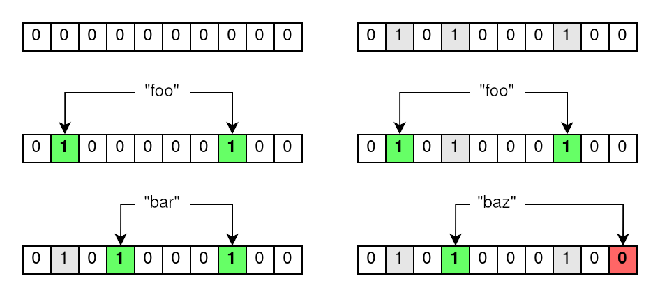
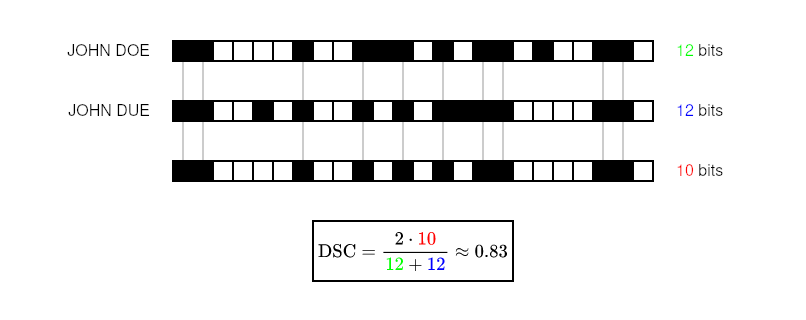

+++
date = '2022-10-29T15:43:12+02:00'
draft = false
title = 'Find duplicates in your datasets with this one weird data structure'
tags = ["cybersec", "privacy", "pprl", "security", "infosec", "programming", "code", "python", "linkage", "record", "data", "science"]
description = "Let’s consider the following scenario that is definitely not taken from any real-life events. A person is admitted to a hospital with a suspected flu. Upon closer inspection though, none of the symptoms seem to line up with known strains of influenza. Similar observations are reported by other hospitals over the following days. This prompts the doctors in charge to send swabs taken from affected patients to nearby virology laboratories."
+++

> This post is part of a series on Bloom filter based privacy-preserving record linkage.
> If you're new to this series, then I highly recommend you read this post first as a primer on what you're getting yourself into.
>
> - **[Find duplicates in your datasets with this one weird data structure]()**
> - [You show me your bits, I show you who you are]()
> - [How to count bits at the speed of light]()
> - [Becoming one in a million by giving up your data]()

Let's consider the following scenario that is definitely not taken from any real-life events.
A person is admitted to a hospital with a suspected flu.
Upon closer inspection though, none of the symptoms seem to line up with known strains of influenza.
Similar observations are reported by other hospitals over the following days.
This prompts the doctors in charge to send swabs taken from affected patients to nearby virology laboratories.

One of the hospitals receives a test result after some days, and it is worrying: a currently unknown type of virus seems to be making the rounds.
The cooperation of all airline carriers is sought to stop the uncontrolled spread of this new disease.
Customer data of the last two weeks should be queried and matched with the hospital data of infected patients.
Passengers who sat in the same plane with those who are infected should be contacted and warned.

This is the scenario that I opened my master thesis with.
And this is how I want to start a series of posts covering little details that were out of scope for my master thesis.
Because what sounds like something that can be solved with a single database query gets more complicated the deeper you look into it.
But first, let's assess some of the core problems in this simple introduction.

## These darn kids and their ... privacy

"It would be great if there was a single code that we could use to uniquely identify a person, like a human identifier."
These are words that no one ever said.
In reality, this would be a privacy nightmare.
And existing identifiers that come close to this idea, like your social security number or the number on your drivers license, are out of scope for many applications.
I would get very suspicious if my airline suddenly started asking me for my insurance number.

In practice, record linkage is often performed on so-called **quasi-identifiers**, or QIDs for short.
Common QIDs are your first and last name, your biological gender and your birth date.
They also happen to be included in pretty much every application where data about people needs to be collected.
Cool, so we can just collect a bunch of QIDs on every person from several data sources and be done, right?

Well, no.
Because even though these QIDs don't say much on their own, they can become personally identifiable data when combined.
This is a desirable effect in record linkage, but you bet that every somewhat competent data protection officer will sound the alarm at this point.
There is legislation in place like the GDPR in Europe, the HIPAA in the United States, and the Data-matching Act in Australia that regulates the flow of this kind of data.
Sharing a fraction of this data can be problematic even for research purposes, that is if you're even allowed to do that in the first place.
So let's pretend that we lawyer up and we get some sort of data sharing agreement going.
This should be the end, right?

Still, no.
We still have to deal with errorenous data.
Let's assume the personal data of John Doe is present in two different datasets.
Misspellings of their name could be a simple typo like "John Due" or "John Doé", or something evil like "John Dоe"[^1] which, although unlikely, is an error that could happen due to optical character recognition for example.
Whether it's due to human error or a technical malfunction, these types of errors are probably more common than you think.
In record linkage, handling these type of errors has been an area of research for decades now, and it is still actively being worked on.

To summarize, there are three main problems that need solving.

1. We cannot use universal identifiers and have to rely on QIDs instead.
2. We cannot assume that we'll be given QIDs due to privacy concerns.
3. We have to account for typographic and technical errors in data.

A possible solution to this problem was discovered by researchers in the early 2010s, using a nifty data structure that was first described in the 1970s.

## A blooming prospect

Burton Howard Bloom conceived the idea of a probabilistic data structure to test if an element is in a set with some false positive probability, which became known as a **Bloom filter**.
To put it bluntly, a Bloom filter behaves a bit like a dictionary of things.
You can put things into a Bloom filter for the purpose of looking them up at a later point in time.
When you ask the Bloom filter whether it contains a thing or not, you will get one of two answers:

- The thing **may have been inserted** into the Bloom filter.
- The thing **has definitely not been inserted** into the Bloom filter.

This means that the "positive" response has a certain probability of being false.
But what good is a dictionary that doesn't know for sure whether it contains something or not?
Bloom filters are ridiculously efficient when it comes to the amount of memory they use.
They are often used in software where lookup operations happen very frequently and are time-critical.

An example of Bloom filters in action are content delivery networks (CDNs)[^2].
CDNs consist of servers spanning the entire globe that offer large amounts of content to clients.
This content needs to be kept in sync between servers in a CDN.
Suppose server _A_ has files that server _B_ does not have, then server _B_ can use Bloom filters to inform server _A_ about missing files.
Server _B_ populates a Bloom filter with all files it owns (or their signatures, more realistically) and sends it to server _A_.
Now server _A_ can traverse its own files and look them up in the Bloom filter that server _B_ sent.
The Bloom filter guarantees that missing files will definitely be identified as such, which server _A_ can then send to server _B_.
And while there may be some false positives, this is still significantly faster than a thorough file-by-file comparison.

With this short dive into Bloom filters and their applications out of the way, let's have a look at their inner workings.
Bloom filters are bit arrays of size _m_ which are all initially set to _zero_.
Every item that is inserted into the Bloom filter is run through _k_ hash functions which, consequentially, yield _k_ hash values.
These hash values point to indices in the underlying bit array which are all set to _one_.



Now if you want to test if an item has been inserted into a Bloom filter, you run it through the same _k_ hash functions.
With the _k_ hash values, you check the bits at the corresponding indices in the bit array, yielding one of the two aforementioned results.

- If **all bits are set**, then the item was likely inserted into the Bloom filter.
- If **at least one bit is unset**, then the item has not been inserted into the Bloom filter.

The reason why Bloom filters are prone to false positives becomes apparent here.
Assume you want to check whether an item has been inserted into a Bloom filter.
You get a positive result, but you cannot know for sure if the referenced bits were set by any other combination of items that have actually been previously inserted into the Bloom filter.
This false positive probability can be computed using _m_, _k_ and the amount of inserted items, but it boils down to the following intuitive statements.

The probability of a false positive test result **increases** ...

- ... the **fewer bits** there are.
- ... the **more hash functions** there are.
- ... the **more items** have been inserted.

## BLAKE2d-SHA-1024-WhirlpoolMD-384 maybe?

When I first learned about Bloom filters, there was one thing that stumped me, and I think it is worth mentioning here.
I talked about the need for _k_ different hash functions.
Try to name all hash functions you can think of (without cheating!), whether they're cryptographic or non-cryptographic.
How many can you name?
Does it make sense that _k_ can be arbitrarily large?

Turns out it does!
Kirsch and Mitzenmacher[^3] were the first ones to describe a sort of "double hashing" scheme.
Assume you run an item through two hash functions, yielding the two hash values _h_1_ and _h_2_.
One can create a new "uber" hash function called _g_ defined as _g(i)=h_1+i\*h_2_, where _i_ runs from _1_ to _k_.
With two base hash values and a simple linear combination, you can generate an arbitrary amount of hash values using _g_.

But it gets even better, because you don't even need two hash functions to begin with.
Let's assume we're only using _SHA-256_.
_SHA-256_ yields a 32-byte hash digest.
We can set _h_1_ and _h_2_ to be the 16 high- and low-order bytes respectively, splitting our hash digest into two separate hash values.
This is what all modern Bloom filter implementations do, and what hash functions like _MurmurHash3_ are for and ruthlessly efficient at.

If all of this flew over your head and you're the type of person who prefers to look at a code snippet rather than lengthy explanations, fret not.
I cooked up some code in Python which implements a very, very rudimentary Bloom filter with _SHA-256_ as the backing hash function.
It's not efficient and it's not meant to be, but feel free to try it out to strengthen your understanding of Bloom filters.

```python
import hashlib
import struct


def new_bf(m: int) -> list[int]:
    return [0 for _ in range(m)]

def compute_hash_values(k: int, value: bytes) -> list[int]:
    value_hash = hashlib.sha256(value).digest()   # hash the value with SHA256

    h1 = struct.unpack("Q", value_hash[0:8])[0]   # take the first 8 bytes and convert to 32-bit int
    h2 = struct.unpack("Q", value_hash[8:16])[0]  # take the second 8 bytes and convert to 32-bit int

    return [h1 + (i+1) * h2 for i in range(k)]    # compute values with double hashing scheme

def insert_into_bloom_filter(bf: list[int], k: int, value: bytes):
    m = len(bf)

    for h in compute_hash_values(k, value):
        if h < 0:      # check if the hash value is negative
            h = -h     # if so, simply invert it

        bf[h % m] = 1  # set the corresponding bit to 1

def test_bloom_filter(bf: list[int], k: int, value: bytes) -> bool:
    m = len(bf)

    for h in compute_hash_values(k, value):
        if h < 0:           # same trick as above
            h = -h

        if bf[h % m] == 0:  # if any bit is not set, then we can be sure that the value has not been inserted
            return False

    return True  # otherwise, all bits match, meaning that the value might be part of the bloom filter


bf = new_bf(64)  # create a new 64-bit bloom filter
k = 3

insert_into_bloom_filter(bf, k, b"foo")  # insert "foo" into the bloom filter
insert_into_bloom_filter(bf, k, b"bar")  # insert "bar" into the bloom filter

print(test_bloom_filter(bf, k, b"foo"))  # this will return True since we inserted "foo" into the bloom filter
print(test_bloom_filter(bf, k, b"baz"))  # this will *most likely* return False since not many bits are set yet
```

Unnecessary details aside, let's finally bridge the gap to record linkage.

## Filtering matches ... get it?

**Privacy-preserving record linkage** (PPRL) based on Bloom filters falls into the category of probabilistic record linkage methods.
This means that given a pair of records, we compute their similarity, usually in the range of 0% to 100%.
If this similarity is above or below a certain threshold, we classify the record pair as a match or a non-match respectively.

> Just as an aside: deterministic record linkage --- the other category of record linkage methods --- works fundamentally different.
> Given a record, we try to construct a so-called "match key" that's identical between similar records.
> You can think of it as an attempt to generate a synthetic identifier based on attribute values of a record.

So the idea is as follows: we generate a Bloom filter for every record.
Then we use the constructed Bloom filters to somehow assign a similarity to record pairs.
If we were to put an entire record into a Bloom filter, then we wouldn't have gained anything, since the bit patterns generated by similar record pairs would be fundamentally different.
This is why Schnell et al.[^4] were the first ones to describe a clever record linkage algorithm using Bloom filters.

Let's take "John Doe" as our example record.
It consists of two attributes, namely the first name "John" and the last name "Doe".
First, we normalize these attribute by converting them into all caps, yielding "JOHN" and "DOE".
Next, we split every attribute into text tokens of the same size.
These tokens are also called **q-grams**, where _q_ represents the length of these tokens.
So if we split the attributes into 2-grams, also called bigrams, we're left with "\_J", "JO", "OH", "HN", "N\_" for the first name and "\_D", "DO", "OE", "E\_" for the last name.
The underscores represent padding characters.
They're used to give the characters at the start and the end of an attribute value the same weight as every other character.
With a predetermined filter size _m_ and amount of hash values _k_, we now create a new Bloom filter and insert every token generated by the record into it.
The resulting bit pattern inside the Bloom filter is also called **cryptographic long-term key** (CLK).


When we repeat the same process for a similar record like "John Due", we find that the resulting bit pattern will be similar to that of "John Doe".
Because of the tokenization step, most tokens that are inserted into the Bloom filter will be equal, with the exception of the tokens generated by the typo in the last name.
This means that just by using Bloom filters, we get built-in error tolerance for free.

The similarity between two CLKs is then computed by looking at the overlapping set bits.
A similarity measure that is commonly used in Bloom filter based PPRL is the Sørensen-Dice coefficient.
Given a pair of CLKs, let _X_ and _Y_ be the amount of set bits in each CLK.
Let _U_ be the amount of set bits in the intersection of both CLKs.
Technically speaking, you're counting the set bits after performing a bitwise AND with both CLKs.
The similarity is then computed as _2U/(X+Y)_.



And now we are where we want to be!
All that's left to do is to select a threshold and to classify pairs of CLKs as matches and non-matches.

## What's next?

Let's go back to the list of problems I wrote up at the start of this post and see if we solved them all.

1. We don't have to rely on universal identifiers. We can work on QIDs just fine.
2. When using cryptograhic hash functions, reconstructing personal data based on a bit pattern generated by a Bloom filter becomes infeasible.
3. Typographic and technical errors are accounted for by performing the normalization and tokenization steps before constructing the Bloom filter.

Sounds good, right?
This means Bloom filters are the silver bullet to perform record linkage in a privacy-preserving matter.
Another problem solved forever!

Of course, it's not that simple.
I wouldn't dedicate a whole series of posts to this topic if that's all there's to it.
This post is simply a primer on Bloom filter based PPRL.
And I assume that people working in cybersecurity reading this post are rightfully skeptical about whether the solution to record linkage is truly this simple.

In the next instalment, I will cover some re-identification attacks on Bloom filters and showcase one particularly effective attack that is as simple as it is dangerous.
Because even though determining the data that generated a specific bit pattern sounds infeasible, it is by no means impossible.

[^1]: The "o" in "John Doe" is the Cyrillic small letter "о". This is a so-called homoglyph and the Unicode specification is full of them.

[^2]: See: Broder, Andrei, and Michael Mitzenmacher. "Network applications of bloom filters: A survey." _Internet mathematics_ 1.4 (2004): 485-509.

[^3]: See: Kirsch, Adam, and Michael Mitzenmacher. "Less hashing, same performance: Building a better bloom filter." _European Symposium on Algorithms._ Springer, Berlin, Heidelberg, 2006.

[^4]: See: Schnell, Rainer, Tobias Bachteler, and Jörg Reiher. "A novel error-tolerant anonymous linking code." _Available at SSRN 3549247_ (2011)
