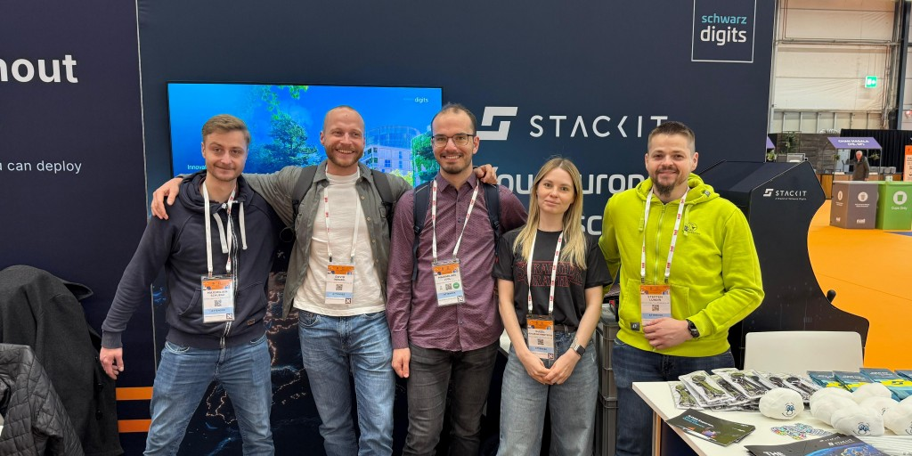
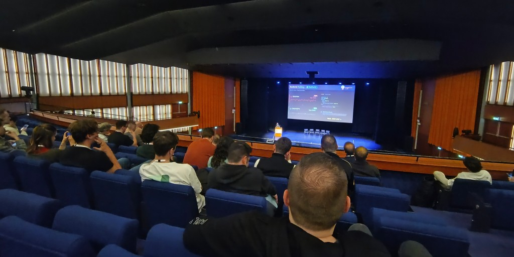
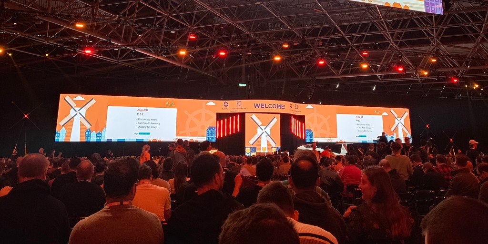

+++
title = "A first-timer's impressions of KubeCon Europe 2026"
date = 2026-03-27T20:20:21+01:00
draft = false
tags = [ "cloud", "native", "k8s", "cncf", "conference", "kubecon", "cloudnativecon", "ai", "artificial intelligence", "security", "cybersec", "cybersecurity", "runtime", "ctf", "capture the flag", "challenge" ]
+++

KubeCon and CloudNativeCon Europe 2026 recently concluded.
I was fortunate enough to be a part of the whole event from start to finish --- from the co-located events on Monday to the talks and showcases until Thursday.
It was my first KubeCon and the first event of this scale that I ever attended.

It was an awesome experience, albeit exhausting.
I had no idea that networking, socializing and soaking up all of what's new and shiny in the cloud native space for four days in a row could drain me that much.
But now that the dust has settled, I have a lot of things I want to talk about, starting with the topic that dominated every single conversation I had at the event.

## Before we get into the interesting stuff...

You knew it was coming.
I knew it was coming.
Everyone knew it was coming.

The vast majority of solutions and talks presented at the event pitched their thoughts and ideas on the AI-heavy present and future that we're shaping right now.
I learned that it's no longer called "vibe coding" but rather "agentic engineering".
I also learned that the value propositions of AI are as diverse as the sheer amount of available swag at the event (I doubled my luggage and ripped a hole in my travel bag due to the extra weight).

Each provider has their own ideas on how to best integrate AI into my daily work --- some more convincing than others.
What really interested me though was how company _actually_ used AI to make their lives easier.
A stand-out talk that I attended was on [intelligent drift detection in ArgoCD](https://colocatedeventseu2026.sched.com/event/2DY6y/beyond-gitops-building-intelligent-drift-detection-and-auto-remediation-in-argo-cd-ram-mohan-rao-chukka-jfrog-shibi-ramachandran-ing).

During the event, I got the overall perception that I was being told to just slap AI on my problems and it'll work out somehow.
This talk however highlighted the importance of guardrails and how to build trust in AI-driven decisions.
It's a common wisdom to treat AI like you would any other coworker who can make mistakes.
I now understand that this also means that AI needs to earn my trust before I allow it to make decisions that _could_ end up causing expensive mistakes.

Aside from that, KubeCon has shown me that the current state of AI is extremely overwhelming.
There is potential and everyone's trying to find it and capitalize on it, but it'll still take some time to find out what's really going to stick.
Some AI trends I've noticed are solutions focused on context enrichment and using it on all things related to observability.
It's not going anywhere, but I'm excited to see which options _really_ prevailed at KubeCon 2031.

## So. Many. Talks.

At KubeCon, I was expecting to hear about new approaches and clever solutions from industry professionals.
The line-up of topics was massive and it was often difficult to choose between multiple talks happening at the same time.
Good thing I had coworkers to attend these sessions in parallel.

Now that the event is over, I feel a bit divided.
Talks that sounded good on paper turned out to be exec-level summaries with no real depth behind them.
Then again, other talks that I might've dismissed at any other opportunity turned out to be incredibly insightful and valuable.

The presenters of the latter group of talks were mostly open source project maintainers.
A really cool talk that I attended on the final day of the event was on [advanced usages of Kyverno](https://kccnceu2026.sched.com/event/2EF49/advanced-kyverno-patterns-automating-platform-security-and-operations-frank-jogeleit-nirmata-johannes-sonner-deutsche-telekom) beyond its primary use as a policy engine.
One of the presenters was the maintainer of [Kyverno Policy Reporter](https://kyverno.github.io/policy-reporter/) which was a fun surprise.
It was really cool knowing that people working on projects we use in our daily work were there to share their in-depth knowledge.

Another talk that I enjoyed a lot was on the [performance of Istio running in ambient mode](https://kccnceu2026.sched.com/event/2CW2a/istios-ambient-mesh-the-real-cost-of-sidecar-less-tracing-mofesola-babalola-tempoio-hannah-olukoye-mobilede).
It touched on a lot of important considerations for using Istio in production backed by real-world experience and benchmarks.
It was a dense but cohesive talk, in-depth but knew how to circle back to its core messages.

Covering the whole range of topics that is appealing to high-level decision makers and low-level engineers is challenging.
I get that.
As for myself, for the next KubeCon, I definitely know which kinds of talks I'll be looking out for.

## Safe Defaults

Everyone's supply chain was on fire right on time for KubeCon: [Trivy was hit by a malicious actor poisoning Docker and GitHub release tags for the official Trivy action](https://github.com/aquasecurity/trivy/discussions/10425).
This was often referenced during the Open Source SecurityCon on Monday.
Hence the panel discussion hosted that day titled "It's Not If, It's When - Practical Preparation for the Next Software Supply Chain Attack" really couldn't have come at a better time.

Of course AI was also a topic, both in its use to discover security vulnerabilities and its ability to generate slop security reports that waste open source maintainers' time.
I had to think of Daniel Stenberg repeatedly calling out AI-generated reports received by the curl security team on HackerOne, [then moving security reports to GitHub Security and then back to HackerOne, but without the incentive of a bug bounty](https://daniel.haxx.se/blog/2026/02/25/curl-security-moves-again/).
If even a software project as popular and well-maintained as curl is struggling to keep up, how could any other open source project?

During the panel, it was said (by Justin Cormack, I believe) that no one is owed anything by open source maintainers.
If they only allow pull requests by trusted maintainers, they are in every right to do so.
If they do not provide a Dockerfile because they don't know how to, again, they are in every right to do so.
If they do not know how to set up CI/CD, SBOMs, attestations, code signing ... you get the idea.

Setting up and maintaining these things takes time that maintainers don't always have.
Every little extra bit that they need to focus on outside of their actual project increases the risk of misconfiguration, developer burnout and so on.
And that's in part how supply chain attacks and compromises happen.

As I'm writing this post, I noticed that [Daniel Stenberg recently released another blog post on not just trusting but verifying dependencies](https://daniel.haxx.se/blog/2026/03/26/dont-trust-verify/).
It echoes the responsibilities that cloud engineers like me carry to make sure that what we're running on our compute resources is exactly what we believe it is.
And if I've learned one thing from KubeCon, it's that we got our work cut out for us --- especially with the additional pressure of AI everywhere.

## Wait, there's a CTF?

My meticulously planned schedule for the entire event got bombarded once I found out there was a Capture The Flag event hosted by the folks over at ControlPlane.
It's been a long time since I participated in a CTF and since I was already there, I felt like I would've been missing out had I not participated.
I was able to team up with one of my coworkers and we spent two hours trying to get at least one flag.

We ended up getting four out of eight flags.
Big success!
Given that I never participated in a CTF where the target was a k8s cluster, I felt like I did pretty well.
After the scoreboard closed, I was able to get a fifth flag too thanks to a hint from one of the other attendees.

In total, we completed two out of three scenarios, leaving only the hardest one because we had other things to attend to on that day.
After reading [Skybound's write-up on the CTF](https://www.skybound.link/2026/03/kubecon-eu-2026-ctf-writeup/), I feel like at least one more flag would've definitely been feasible.
Then again, we had spent so much time on chasing down the wrong path in the second scenario that our judgment was clouded by the end of the CTF.
Still, great fun.
Got me wanting to do more CTFs again.

## Dag, tot ziens!

Every evening, my brain was buzzing.
There was so much to take in and so many chats with awesome people to process.
It's been a while since I felt this _drained_.
But KubeCon this year left me with a lot of valuable and fresh ideas and I can't wait to put them into action.

After a much needed respite, of course.

