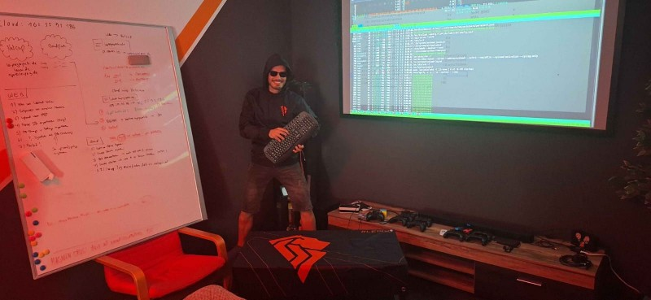

+++
title = 'Lessons from my first year as a voluntary tech lead'
date = 2025-04-18T13:29:29+02:00
draft = false
description = "I've been the technical lead at our local eSports club for a year now. There's a lot that happened as I was working to erase tech debt and make sure that everything keeps running smoothly to serve over 150 club members. Despite occasional hiccups, I'm positive things can only go up from here."
tags = ["tech lead", "it lead", "leadership", "volunteer", "voluntary", "linux", "ubuntu", "server", "administration", "admin", "lessons", "esports", "esport", "selfhost", "selfhosting", "backup", "borg", "borgbackup", "strategy", "future", "hosting", "webhost", "webhosting", "docs", "docu", "documentation"]
+++

It's now been a year since I took over the technical lead at Leipzig eSports (hereinafter: LES) --- a local club aiming to get people together under the banner of computer games and so much more.
We're now at well over 150 active members, thousands of followers on social media, some very cool brand collaborations and a strong presence at many events even beyond the borders of Leipzig.
But as these things usually go, there is a lot of stuff behind the scenes that goes unnoticed by the public eye.

Being the technical lead at LES is my first "true" leadership position in life.
Sure, I lead a small team of developers at my current day job, but I am still one single gear in the machinations of a nationwide project.
I don't get to call the shots like I do at LES.
And while this past year has been extremely stressful at times, it has been incredibly rewarding.

Ahead of our upcoming general assembly, I want to take some time to talk about the things that I learned along the way.
I've been wanting to talk about these things for a long time now, but you will probably realize why I haven't done so up until now.
Spoiler: it is an absolute miracle that we didn't get hacked ten times over.

## Self-hosting is never free

I spent my fair share self-hosting services for my personal projects.
The utility of these services in my everyday life was secondary.
In fact, I've since moved on from trying to self-host everything and switched to managed hosting solutions because I simply did not have the time to look after maintaining these services as much as I would've liked.
But what the self-hosting experience gave me was a lot of server administration experience: hard skills like working with various web servers, databases, Docker, Kubernetes, but also soft skills like moving on the command line, understanding error logs and reading technical documentation.

When I've been handed the keys to the kingdom (read: given root access to all our servers) at LES, I was impressed and shocked by the fact that they've been trying to self-host absolutely **everything**.
Yes, even email, which has a lot of notorious footguns that has self-hosting veterans suggest that one is better off just paying someone else to do it.
This wouldn't have been as big of an issue if a) the email server wouldn't occasionally and inexplicably strangle itself and no one really knew why and b) all installed software hadn't been patched or updated in **well over a year**.

To give a specific example: we rented two root servers, one for hosting containerized services, one as a dedicated web server for running Plesk.
The latter was still running Ubuntu 16 which was well and truly EOL and there was a supposed dependency loop between Plesk and Ubuntu which meant neither could be updated easily.

I've been told that one of the former leads who had long left the club made the push to self-host everything but ended up getting overwhelmed with the administrative burden over time that was put on the club and its tech-literate members.
Now, operating a club is still volunteer work at the end of the day, but I feel like the maintainability aspect of this decision may have been severely underestimated.
You're still providing the means for other club members to do their work and they generally expect them to be available at all times.
When I figure out whether to self-host a particular service, I thoroughly evaluate whether the administrative effort _after_ the initial setup is worth the benefits that me and other club members can reap from it.

It was apparent to me that the state of the club's infrastructure was neither maintainable nor reliable, so I set the main goal for my first year to migrate to a more self-sustainable infrastucture that would require minimal administrative intervention.
I was aware that this would be a monstrous undertaking, but one unexpected turn would make everything a lot more challenging.

## Where are the docs, Lebowski?

I took over the tech lead from someone who was there at the time when the club made the switch to self-host everything and tried to keep things running as best as they could.
They were super friendly, most likely because they were happy to know that someone else would bear the responsibility now.
Nonetheless, they told me that they would assist me and help me understand all decisions that led to the mess that I inherited.

Then they unexpectedly passed away.

They had been dealing with a long-term medical condition that eventually took its toll.
No one except their closest friends were in the know about it and it came as a shock to a lot of the club's members.
They left behind their partner and a child.

I didn't know them personally but I still massively appreciated their help.
Still, that left me needing to figure out everything mostly by myself.
There were some club members who knew a thing or two about the club's infrastructure, but no one was able to give a truly comprehensive overview.
The only kind of documentation I could somewhat reliably use were monthly tech reports[^1], although they greatly varied in their usefulness.
I was also sent an out-of-date infrastructure diagram which was better than nothing, but the information that I could pull from it was very limited.

To migrate our root servers, I also had to find out _who_ was hosting them, but no one really seemed to know.
This was resolved in a one-hour call with the partner of the recently deceased tech lead.
I was very thankful that they agreed to help amidst their grief.
Then again, they were probably also happy to have one thing less to worry about.

I think I made it clear that any kind of documentation was very, _very_, **very** hard to come by.
It's in the nature of volunteer work that you're very likely not going to do it forever and whenever that end comes, you better have something to help the people who come after you understand what you've been doing.
Any documentation is better than no documentation.

All things considered, the server migration was done in a single weekend thanks to a lot of helping hands.
During that entire ordeal, we noticed a lot of major and minor issues that hadn't been taken care of which we tackled in the months that followed.
We were hosting quite a few misconfigured services with moderate to severe security vulnerabilities.
The final service was upgraded to an actually maintained version just this month.

Since then, I've been looking into ways of writing proper documentation.
Unsurprisingly, it's not easy which is also the reason why any kind of documentation ends up falling short in one way or another.
There's no single perfect way of doing it.
What works best for me is to stick to a certain method, then write bad docs, then write better docs, rinse and repeat until they're somewhat decent.

## Backups can be cool too

While we were onto the last few things to do after the server migration, I conceived a plan for backups of the data on our servers.
Up until then, there had never been a single copy of the data stored on our Nextcloud for instance, despite harboring confidential and super important files for people to get their work done.
There had been plans in the past, even going as far as to buy a NAS to keep all the data safe at our clubhouse, but these plans never came to fruition.
Instead, we had 12 TB of storage catching dust.

I had never really thought about a proper way to do backups up until then.
My personal disaster recovery plan is to keep all important data on my own managed Nextcloud and reimage any computer that might fail on me.
It's been going pretty well so far.

Out of all the backup tools that came to my attention, [BorgBackup](https://borgbackup.readthedocs.io/) was the one that I ended up basing the club's backup strategy on.
In combination with [Borgmatic](https://torsion.org/borgmatic/), we now have fully declarative, deduplicated and encrypted backups of our most important data.
It's awesome.
I never thought I'd be calling a backup tool awesome but here we are.

I don't have to stick to writing and debugging Bash scripts.
The entire backup configuration is spread across a couple YAML files and Borgmatic is simply invoked with a Cronjob at night.
I don't have to blindly trust that backups will just work.
Whenever backups fail, a webhook is triggered which will ping me on Discord to let me know that something went wrong.
I've been able to make the 3-2-1 rule for backups work and setting it all up was actually kind of fun.

Then again, backups are only valuable if they're also being tested periodically.
Backups make no sense if no one knows how to apply them.
We're still missing an actual sequence of steps to take when disaster actually strikes.
This, too, is something I am planning on doing as I'm working on our internal documentation.

## In Germany we call it "Macher"

I like getting stuff done.
I don't sleep easy at night knowing there is stuff that I should be doing.
It's a double-edged sword depending which way you look at it, because it also means I have to put in extra effort to prevent overworking myself.
I pushed hard to make a lot of things happen in the past year and it sometimes came at the expense of sacrificing time that was meant for me.
When that happened, it threw me off the tracks of my personal life more than I expected.

What I still need to get better at is to actually delegate tasks to other people.
Granted, we currently have one, maybe two volunteers at LES who could feasibly take on administrative tasks, but now that we have a modern, maintainable and secure IT infrastructure, it's the best time to get them on board and put them in charge.

It's kind of funny because when I started writing this post, I wasn't sure where I would ended up going with it.
It allowed me to comb through all the things that happened last year and come up with specific steps I'd like to take next year.
At this time, this year's elections for all leadership positions at LES are ongoing.
I'm pretty positive that I will be the tech lead for another year and I'm sure that I got at least one more year in me.
So, for future reference and for those at LES who might end up reading this post, these are the key points that you can and should hold me accountable for:

1. Reach out to new volunteers interested in server administration and get them on board
2. Finalize our internal technical documentation for the current state of our infrastructure
3. Get people familiar with our documentation system and have them keep it up-to-date
4. Work out a disaster recovery plan for when services fail or data is lost

Keeping things working will obviously remain the top priority, but we're now in a position where everything is running remarkably stable without us having to do much.
We've had a few incidents which were resolved in a matter of hours at most and didn't impact the club's operations at all.
I am certain that things will only get better from here on out.

[^1]: I generally do not consider a bundle of notes to be documentation.
