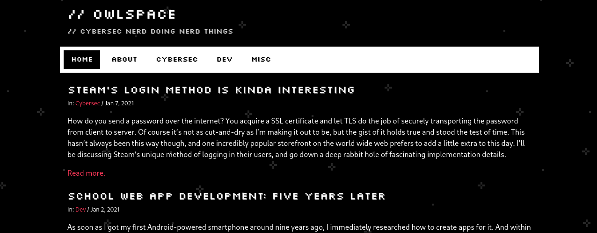
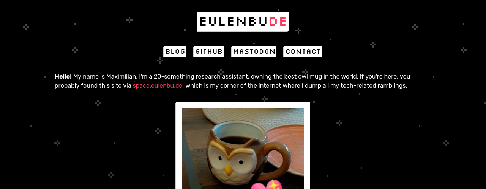
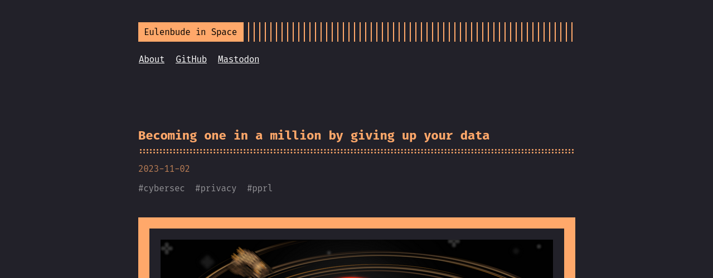
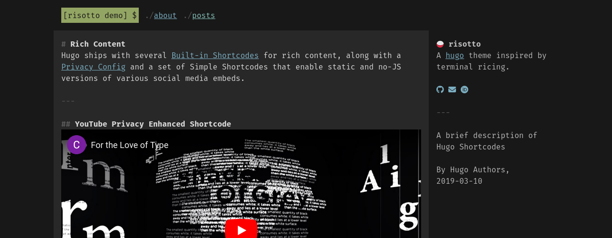

+++
date = '2024-12-19T21:02:01+01:00'
draft = false
title = 'Termeul'
+++

Termeul is the name of the theme for this website.
[You can check it out on GitHub.](https://github.com/JoogsWasTaken/termeul)

<!--more-->

The name consists of "term", short for "terminal", and "eul", which is the German word for "owl" but with the last letter missing.
Termeul is pronounced like "turmoil" which aptly describes the creation process of this theme.

## Owlspace

It all started in 2020 when I first wanted to share my thoughts with the whole world.
Owlspace was the name of my first proper domain that I used to express myself.
At the time, I was still a cybersecurity student.
I published writeups of challenges from TryHackMe and HackTheBox and the occasional technical write-up of things I found fascinating.

In the process of researching my setup, I stumbled upon [Hugo](https://gohugo.io/) which is the static site generator that I use to this day.
None of the premade themes appealed to me so I set out on the quest to design my own.
Given that I was still in university, I had plenty of time to add all the bells and whistles that I wanted back then.

The website received a lot of traction due to my [Telegram "People Nearby" writeup](), my [Steam login writeup]() and the cute owl at the bottom of the page that you could pet.
Unfortunately, due to a lot of changes in my personal life and unforeseen struggles, I abandoned Owlspace as well as the theme which was starting to break because I didn't have the time nor the energy to fix it.

## Eulenbude in space

At the end of 2022, I finally found myself with spare time on my hands.
Having finished my master thesis, I suddenly had more material to publish, but I had already announced my departure from Owlspace.
Reviving the old domain felt weird, so I got the Eulenbude domain which literally translates to "owl booth" and has the .de-TLD as part of its name which felt cool --- and it still does!

I wanted to keep the charm of Owlspace but keep the effort of theming minimal.
So I manually crafted the main page that is hosted on the homepage to replicate the magic of Owlspace and used a premade Hugo theme for my actual writings which were hosted on a separate subdomain.
This blog used the [Terminal theme](https://github.com/panr/hugo-theme-terminal).

I was never completely satisfied with this setup because suddenly I had two separate websites to tend to.
While Terminal is an amazing theme for the type of content that I publish, it didn't feel very cohesive given the design of the main site.
And to be completely fair, I wasn't happy with the main site as well because it was hastily put together and I made the maintenance of this site harder on myself by rolling my own static site generation.

## Eulenbude, as it should be

Third time's the charm, and it was clear to me that I wanted a custom theme again to pin down the look and feel that I want my personal website to have.
However, I didn't want to go overboard with the theming, so I made a list of requirements.

- White text on a dark background for contrast and legibility
- Main page with personal info and a brief main menu
- No external dependencies (CDNs in particular)
- Functional even when JavaScript is disabled
- Keep the stars in the background and the pettable owl

I drew a lot of inspiration and ground work from the [Risotto theme](https://github.com/joeroe/risotto).
With some minor modifications to its typography, layout and sizes, I had a solid skeleton to apply my own design choices to.
I also love that it keeps the management of its stylesheets simple instead of using Hugo's built-in pipelines which, while amazing, require a lot more fiddling.
This lifted a lot of the ground work that comes with crafing a cohesive theme off my shoulders.

On the old Eulenbude homepage, I had a simple repeating background that moves along as you scroll.
With Termeul, there's now multiple layers, more colors and a parallax effect as you scroll to give the website more visual depth.
If the background doesn't scroll on your device, then it's because the theme honors the user's preferences for reduced motion.
This also applies to the owl at the bottom of the page now.
[Iosevka](https://typeof.net/Iosevka/), which is the typeface for this website, has also been optimized for faster loading times.

Personally, I'm very happy with how Termeul turned out.
It uses very few templates, has a great overall look and is based on the work of awesome people who know a lot more about crafting good themes than I do.
You can install it like any other Hugo theme by [following the instructions in the Termeul repository](https://github.com/JoogsWasTaken/termeul?tab=readme-ov-file#install).
